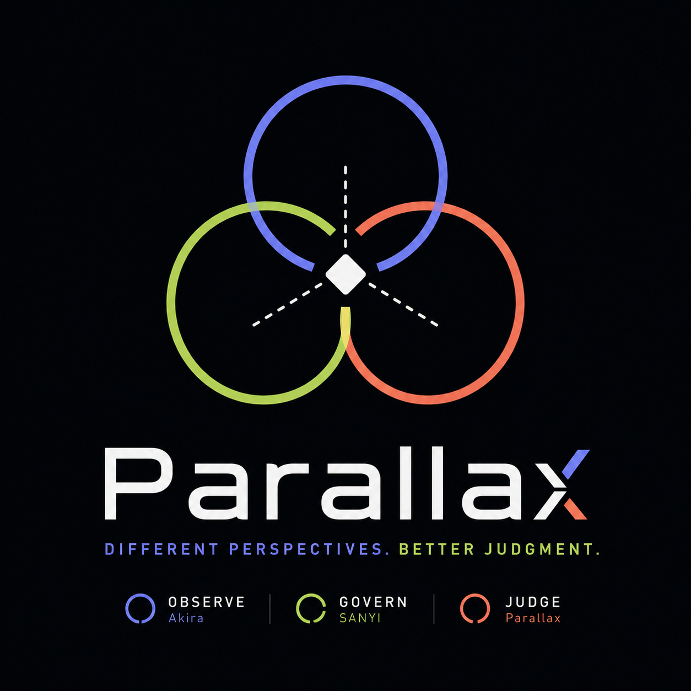

<h1 align="center">Parallax</h1>

<div align="center">
  
</div>

<p align="center">
  <em>Evidence-driven PR review for general and agentic software changes.</em>
</p>

---

Parallax applies a general software-engineering review to every pull
request, and conditionally adds agent-system review for changes involving
LLMs, agents, tools, workflows, retrieval, memory, evaluation, or
human-agent handoffs.

## Meaning

Parallax is the apparent shift in an object's position when viewed from
different perspectives. A pull request has the same property: the author,
reviewer, tests, runtime traces, architecture contracts, and domain-specific
scanners each reveal a different part of the truth. No single perspective is
sufficient on its own.

Parallax combines these perspectives to help a human reviewer locate the
real risk, understand the change, and make an evidence-based merge decision.

## How it fits the existing system

| System       | Role                                                                                          |
| ------------ | --------------------------------------------------------------------------------------------- |
| **SANYI**    | Governs whether the change respects the architecture change contract.                         |
| **Parallax** | Judges the change from multiple perspectives — combines, verifies, and decides if it's ready. |

```text
SANYI governs.
Parallax judges the change from multiple perspectives.
```

Parallax integrates SANYI's findings without replacing or rewriting its
native output schema — SANYI remains an independent system with its own
lifecycle, reachable and useful outside of a PR review. One of Parallax's
review subagents preloads SANYI's ruleset directly (via a Claude Code
subagent's `skills:` field) so that composition is guaranteed whenever a
repo has a `SANYI.md`, rather than depending on a runtime decision to
invoke it — see "How it works" below.

## How it works

Parallax is a thin orchestrator that dispatches up to seven parallel
subagents, each preloaded with exactly the skill for its own review
dimension: intent & correctness, reliability & operations, security &
data, architecture & docs, and — only for agent-system PRs — agent runtime
& tooling, accountability & safeguards, plus SANYI itself when a
`SANYI.md` exists. Each subagent verifies its own findings before
returning them; the orchestrator merges everything, removes duplicates,
and produces one unified report.

Detection isn't a single point of failure: if the initial pass misses that
a PR is agent-related, the always-on subagents can flag what they notice
during their own review, and the orchestrator dispatches the agent-specific
subagents afterward as a correction — rather than silently missing it for
the rest of the run.

Merging findings from all dispatched subagents is a two-pass process, and
only the second pass is model judgment. The first pass — clustering
findings that touch overlapping files/lines and share a category or
symbol — is deterministic code
([`parallax/orchestration/deduplication.py`](parallax/orchestration/deduplication.py)),
so duplicate detection isn't relying on an LLM to compare every finding
against every other finding from scratch. The orchestrator then judges,
only within each small cluster, whether the findings are actually the same
root cause.

## Repository layout

```text
.claude/
├── agents/         # the orchestrator + one subagent per review dimension
└── skills/         # one skill per dimension, plus parallax-shared and
                     # sanyi (vendored) — preloaded into subagents via each
                     # agent's `skills:` frontmatter, not invoked at runtime

parallax/
├── schemas/        # canonical finding/report schema (Pydantic + exported
                     # JSON Schema) every subagent's output is validated against
└── orchestration/  # deterministic, non-LLM support code the orchestrator
                     # calls into: dedup pre-filter, merge-impact prioritization,
                     # agent-system signal detection, git diff-scope resolution,
                     # Markdown report rendering

config.py            # tunables: dedup tolerance, SANYI severity defaults,
                     # subagent retry limit, time budget
tests/               # unit + golden tests for everything under parallax/
```

The `.claude/` tree is what Claude Code actually discovers and runs; the
`parallax/` package is the deterministic backbone those agents call into
via their `Bash` tool for the steps this project treats as too important
to leave to model judgment alone (schema validation, the dedup pre-filter,
report structure). Building an agent and building this code are two
separate, complementary tracks — see
`docs/documents/Evidence_Driven_PR_Review_System_Spec.md` Section 26 for
the full phased breakdown.

## Development

```bash
uv run pytest                                    # run the test suite
uv run python -m parallax.schemas.export_schemas # regenerate the committed
                                                  # JSON Schema files after
                                                  # editing models.py
```

## Core philosophy

> Different perspectives. Better judgment.

Parallax does not optimize for the largest number of review comments. It
aims to:

- reconstruct the intent of the change
- trace behavior from input to impact
- gather evidence from multiple sources
- distinguish verified findings from hypotheses
- identify material risks
- reduce duplicate and low-value review noise
- support a clear, explainable merge decision
- preserve human responsibility for approval
